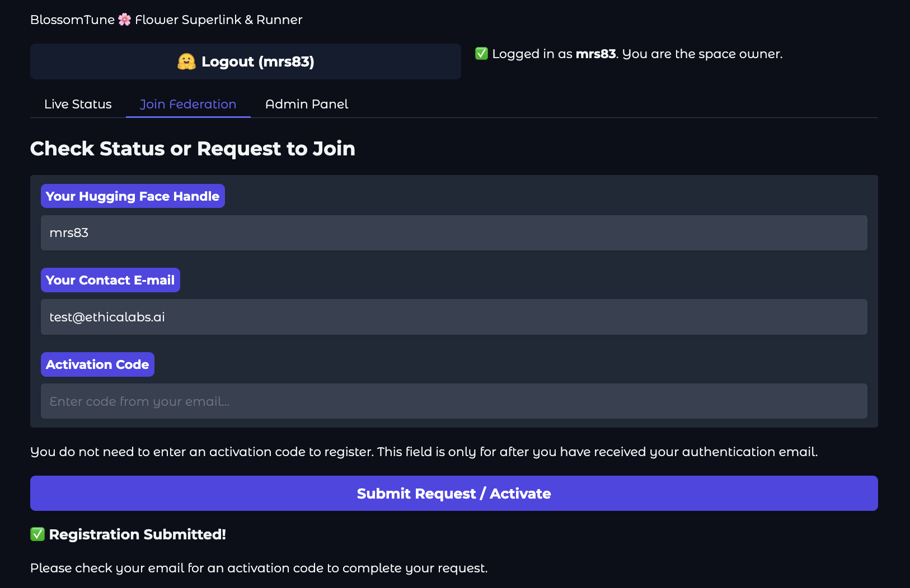
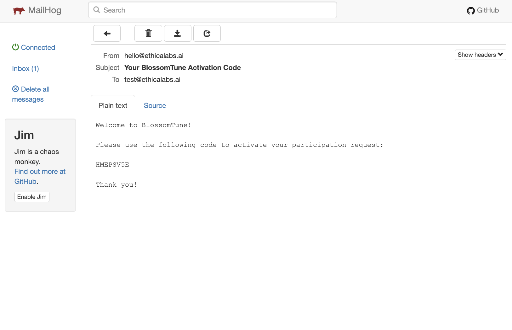
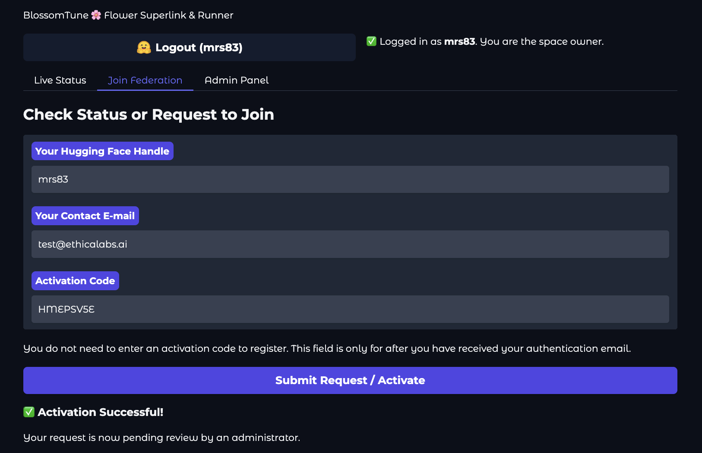

# User Guide: For Participants

This guide explains how to join a federated learning experiment hosted by the BlossomTune Orchestrator.

## 1. Request to Join

1.  Navigate to the orchestrator's Gradio URL.
2.  Go to the **"Join Federation"** tab.
3.  If the app is hosted on Hugging Face Spaces, you must **log in with your Hugging Face account**. Your HF handle will be used as your identifier.
4.  If running locally, enter a unique **Hugging Face Handle** (or username).
5.  Enter your **Contact E-mail** address. This is where your activation code will be sent.
6.  Leave the **Activation Code** field blank for the first request.
7.  Click **"Submit Request / Activate"**.

You should see a confirmation message: "✅ Registration Submitted! Please check your email for an activation code..."

## 2. Activate Your Request

1.  Check your email for a message with the subject "Your BlossomTune Activation Code". (If running locally, check the MailHog UI at `http://localhost:8025`).
2.  Copy the activation code from the email.
3.  Return to the **"Join Federation"** tab.
4.  Your HF Handle and E-mail should still be filled in.
5.  Enter the **Activation Code** into its field.
6.  Click **"Submit Request / Activate"** again.

You should see a new message: "✅ Activation Successful! Your request is now pending review by an administrator."

## 3. Check Approval Status

After an administrator has reviewed your request, you can check your status.

1.  Return to the **"Join Federation"** tab.
2.  Ensure you are logged in (or your HF Handle is entered).
3.  Enter your E-mail and Activation Code.
4.  Click **"Submit Request / Activate"**.

You will see one of three statuses:

* **Pending**: "⏳ Pending. Your request has been activated and is awaiting administrator review."
* **Denied**: "❌ Denied. Your request for ID `...` has been denied."
* **Approved**: "✅ Approved. Your request for ID `...` has been approved."

## 4. Download Credentials (If Approved)

If your request is approved, the status message will include your connection details (like your `partition_id`) and a download button will appear.

1.  Click the download button (e.g., `PARTICIPANT-ID-blossomfile.zip`).
2.  This `Blossomfile` is a `.zip` archive containing everything you need to connect:
    * `blossom.json`: Configuration file with your `partition-id`.
    * `ca.crt`: The federation's public root TLS certificate.
    * `auth.key`: Your **private** authentication key.
    * `auth.pub`: Your public authentication key.

You can now use these files with your Flower SuperNode client to connect to the federation, as shown in the example command in the UI.